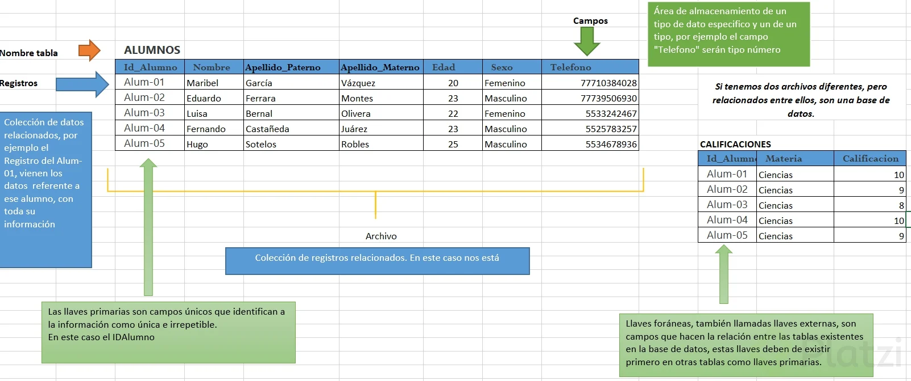
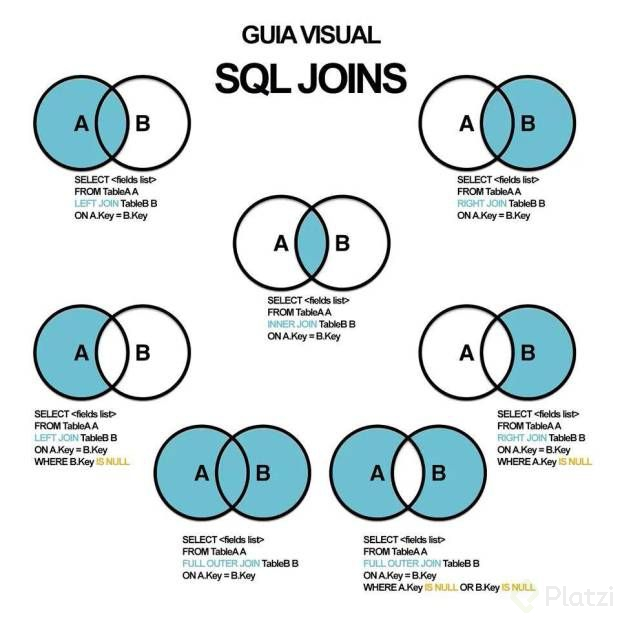

# Determinar el problema a solucionar, la finalidad y los requerimientos.

Antes de comenzar un proyecto de Base de datos, es importante, determinar el eje a seguir para el diseño, ya que estas nos marcarán las pautas para tener un buen resultado.

# Modelado de Entidades

La idea es que se identifiquen los objetos de la base de datos, llamadas entidades. Para el modelado de la base de datos se propone utilizar el “modelado de objetos”, ya que, la técnica propone una forma abstracta de pensamiento acerca de problemas a resolver, empleando conceptos del mundo real, y no conceptos técnicos informáticos. En el proyecto se pueden identificar varios objetos que se relacionan y establecen un flujo de información, estos objetos se llegaran a transformar en tablas bidimensionales, las cuales son el fundamento de este tipo de base de datos relacional.

### Definir entidades.

Recordemos que las Entidades, son objetos o cosas que existen en nuestro alrededor, pensando en el proyecto ¿qué objetos intervienen en el proceso del proyecto? Estos objetos surgen identificando todos los actores que tienen el proceso, posteriormente identifique las relaciones que tiene cada uno, sus responsabilidades, y el papel que tiene en el proceso.

### Definir los atributos

Recordemos que los objetos tienen apartados que son: identificador, atributos y métodos. Productos Toda entidad tiene atributos que la describen, siendo el atributo las características de la Entidad. . 3.- Modelado Relacional. Prototipo de BD sin normalizar. Ahora bien, para el modelado ER, vamos a retomar las entidades, con sus respectivos atributos. En este paso hacemos énfasis en las relaciones de las entidades, mediante la cardinalidad, entendida por la cantidad de relaciones que tienen los objetos. Para comprender la necesidad del proyecto se debe leer detenidamente y ver cómo interactúan los objetos y relaciones de conjuntos, delimitando la asociación. Además, en el modelo ER, se utilizan figuras de relación y se hace uso de las claves principales y las claves foráneas.

- **Diagrama E/R:** Diagrama de entidad- interrelación (E/R) perite representar gráficamente la estructura lógica de una base de datos. Para poder guiarnos y entender de mejor forma la base de datos a realizar. Figuras: • Rectángulos: entidades • Elipsis: Atributos • Rombos: Interrelaciones • Líneas: enlazan los atributos a entidades, atributos a interrelaciones y entidades a interrelaciones.

- **Cardinalidades:** La razón de cardinalidad, expresa el numero de entidades a las que otra entidad puede estar asociada por medio de una interrelación. Existen los siguientes tipos:
  1. Uno a uno (1:1).
  2. Uno a varios (1:N).
  3. Varios a uno (N:1) o la simétrica de la anterior.
  4. Varios a varios o muchos a muchos (N:M).

# Base de datos Normalizada

Continuamos con el paso de normalizar, ¿pero ¿qué es normalizar? Para mejorar el desempeño de una base de datos, así como evitar redundancia en la información que contiene y en consecuencia, generar condiciones para un mejor diseño, se debe conocer las formas de normalización. La normalización de datos es el proceso que permite refinar la construcción de modelos relacional con el objetivo de minimizar la redundancia de datos mediante ciertas normas y restricciones con el fin de evitar futuros problemas cuando nuestra base de datos sea mayor. Su principal objetivo es reducir la redundancia de datos y simplificar las dependencias entre columnas, aplicándose de manera acumulativa.

## Aplicación de Normalización

- **Convertirlas en Tablas:** El modelado relacional, se deberá convertir en tablas, la siguiente imagen muestra las partes que la integran.

  

- **Realizar algunos registros:** Para ayudarse a visualizar mejor los casos en los que estamos cayendo en redundancias, sirve hacer ejemplos de los registros, de esta manera nos podemos percatar en las situaciones donde tendremos problemas con la estructura de nuestra base de datos.

- **Aplicaremos las reglas de Normalización:**

  - 1FN: El valor de una columna debe ser una entidad atómica, indivisible, excluyendo así las dificultades que podría conllevar el tratamiento de un dato formado de varias partes.

  - 2FN: Una tabla se encuentra en 2FN cuando está en 1FN y no contiene dependencias parciales. Por consiguiente, una tabla 1FN automáticamente está en 2FN si su clave primaria está basada solamente en un atributo simple. Una tabla en 2FN aún puede contener dependencias transitivas.

  - 3FN: Cumple con la 1FN y 2FN y los campos que NO son clave, NO deben tener dependencias. Se debe seguir analizando la estructura de las tablas, para evitar que no haya registros con campos no dependientes.

  - 4FN: Cumple 1FN, 2FN, 3FN y los campos multivaluados se identifican por una clave única.

# RDB (relational database)

RDBMS (Relational DataBase Magement System) Sistema Manejador de Bases de datos relacionales.

La diferencia entre ambos es que las BBDD son un conjunto de datos pertenecientes ( o al menos en teoría) a un mismo tipo de contexto, que guarda los datos de forma persistente para un posterior uso, y el Sistema de gestión de BBDD o sistema manejador, es el que nos permite acceder a ella, es un software, herramienta que sirve de conexión entre las BBDD y el usuario (nos presenta una interfaz para poder gestionarla, manejarla).

### RDBMS:

- MySQL
- PostgreSQL
- Etc

Todas toman un lenguaje base, pero cada uno lo apropia, imponiéndole diferentes reglas y características.

# SQL

SQL significa Structured Query Language y tiene una estructura clara y fija. Su objetivo es hacer un solo lenguaje para consultar cualquier manejador de bases de datos volviéndose un gran estándar.

SQL tiene dos grandes sublenguajes:

## DDL

O Data Definition Language que nos ayuda a crear la estructura de una base de datos. Existen 3 grandes comandos:

- Create: Nos ayuda a crear bases de datos, tablas, vistas, índices, etc.

- Alter: Ayuda a alterar o modificar entidades.

- Drop: Nos ayuda a borrar. Hay que tener cuidado al utilizarlo.

3 objetos que manipularemos con el lenguaje DDL:

- Database o bases de datos
- Table o tablas. Son la traducción a SQL de las entidades
- View o vistas: Se ofrece la proyección de los datos de la base de datos de forma entendible.

Nota: las herramientas del DDL se utilizan mayormente en la fase de construcción y mantenimiento de las bases de datos, la manipulación u operación se hace con DML.

## DML

Trata del contenido de la base de datos. Son las siglas de Data Manipulation Language y sus comandos son:

- Insert: Inserta o agrega nuevos registros a la tabla
- Update: Actualiza o modifica los datos que ya existen
- Delete: Esta sentencia es riesgosa porque puede borrar el contenido de una tabla
- Select: Trae información de la base de datos

## Creando las tablas en My SQL

- Una buena práctica es comenzar creando las entidades que no tienen una llave foránea.
- Generalmente en los nombres de bases de datos se evita usar eñes o acentos para evitar problemas en los manejadores de las bases de datos.
- Cuando creamos las tablas dependientes, el comando **CASCADE** sirve para que cada que se haga un update en la tabla principal, se refleje también en la tabla en la que estamos creando la relación.
- Las tablas transitivas sirven como puente para unir dos tablas. No tienen contenido semántico.
- **Reverse Engineer** nos reproduce el esquema del cual nos basamos para crear nuestras tablas. Es útil cuando llegas a un nuevo trabajo y quieres entender cuál fue la mentalidad que tuvieron al momento de crear las bases de datos.

# Consultas a una base de datos (queries)

Los queries son la forma en la que estructuramos las preguntas que se harán a la base de datos. Transforma preguntas en sintaxis.  
El query tiene básicamente 2 partes: SELECT y FROM y puede aparecer una tercera como WHERE.

## Select

SELECT se encarga de proyectar o mostrar datos.

- El nombre de las columnas o campos que estamos consultando puede ser cambiado utilizando AS después del nombre del campo y poniendo el nuevo que queremos tener
- con COUNT(\*) podemso contar la cantidad de registros

## From

FROM indica de dónde se deben traer los datos y puede ayudar a hacer sentencias y filtros complejos cuando se quieren unir tablas. La sentencia compañera que nos ayuda con este proceso es JOIN.

- Con ON seleccionamos que columna va a actuar de pibote.  
  Ej: LEFT JOIN posts ON usuarios.id = posts.usuario_id;

## Where

WHERE es la sentencia que nos ayuda a filtrar tuplas o registros dependiendo de las características que elegimos.

- La propiedad LIKE nos ayuda a traer registros de los cuales conocemos sólo una parte de la información.
- La propiedad BETWEEN nos sirve para arrojar registros que estén en el medio de dos. Por ejemplo los registros con id entre 20 y 30
- Si nesesitamos buscar datos nulos o no nulos, se usa IS NULL y IS NOT NULL respectivamente

## Group By

GROUP BY tiene que ver con agrupación. Indica a la base de datos qué criterios debe tener en cuenta para agrupar.  
Gruop by te permite agrupar estilo pivot tables, e informes.

## Order By

La sentencia ORDER BY tiene que ver con el ordenamiento de los datos dependiendo de los criterios que quieras usar.

- ASC sirve para ordenar de forma ascendente.
- DESC sirve para ordenar de forma descendente.
- LIMIT se usa para limitar la cantidad de resultados que arroja el query.

## Having

HAVING tiene una similitud muy grande con WHERE, sin embargo el uso de ellos depende del orden. Cuando se quiere seleccionar tuplas agrupadas únicamente se puede hacer con HAVING.

# Nested Queries

Los Nested queries significan que dentro de un query podemos hacer otro query. Esto sirve para hacer join de tablas, estando una en memoria. También teniendo un query como condicional del otro.

Este proceso puede ser tan profundo como quieras, teniendo infinitos queries anidados. Se le conoce como un producto cartesiano ya que se multiplican todos los registros de una tabla con todos los del nuevo query. Esto provoca que el query sea difícil de procesar por lo pesado que puede resultar, y se considera como no escalable.

# Convertir una pregunta a un query SQL

Todos los comandos anteriores funcionan juntos de la forma:

- **SELECT:** Lo que quieres mostrar
- **FROM:** De dónde voy a tomar los datos (tablas unicas o con joins)
- **WHERE:** Los filtros de los datos que quieres mostrar
- **GROUP BY:** Los rubros por los que me interesa agrupar la información
- **ORDER BY:** El orden en que quiero presentar mi información
- **HAVING:** Los filtros que quiero que mis datos agrupados tengan
- **LIMIT:** La cantidad de registros que quiero

Otros comandos utiles:

- GROUP_CONCAT: toma el resultado del query y lo pone como campo separado por comas
- DISTINCT: Evita duplicidad en los valores

Tip: Puedes usar una abreviación para evitar escribir lo mismo cada vez.  
Ejemplo: FROM categorias AS c

# Bases de Datos NO relacionales

Respecto a las bases de datos no relacionales, no existe un solo tipo aunque se engloben en una sola categoría.Existen varios tipos:

- Clave - valor: Son ideales para almacenar y extraer datos con una clave única. Manejan los diccionarios de manera excepcional. Ejemplos: **DynamoDB, Cassandra**
- Basadas en documentos: Son una implementación de clave valor que varía en la forma semiestructurada en que se trata la información. Ideal para almacenar datos JSON y XML. Ejemplos: **MongoDB, Firestore**
- Basadas en grafos: Basadas en teoría de grafos, sirven para entidades que se encuentran interconectadas por múltiples relaciones. Ideales para almacenar relaciones complejas. Ejemplos: **neo4j, TITAN**
- En memoria: Pueden ser de estructura variada, pero su ventaja radica en la velocidad, ya que al vivir en memoria la extracción de datos es casi inmediata. Ejemplos: **Memcached, Redis**
- Optimizadas para búsquedas: Pueden ser de diversas estructuras, su ventaja radica en que se pueden hacer queries y búsquedas complejas de manera sencilla. Ejemplos: **BigQuery, Elasticsearch**

Cada base de datos de este tipo soluciona un problema en particular, pero es mala para todo lo demas dada la gran cantidad de datos.

## Firebase

Firebase es un servicio de Google donde puedes tercerizar muchos elementos en la nube. Jerarquía de datos:

1. Base de Datos: Contiene toda la información que se quiere guardar
2. Colección: Es igual a las tablas en las bases de datos relacionales. Son objetos que agrupan (Documentos) la información que se desea guardar
3. Documento: Es la información que se quiere guardar. Se guarda en un formato muy parecido al formato JSON (es un lenguaje que se utiliza para comunicarse con diferentes lenguajes o aplicaciones). Los documentos dentro de ellos contienen datos.

Firebase posee varios tipos de datos:

- String: Cualquier tipo de valor alfanumérico
- Number: Soporta enteros y flotantes.
- Boolenan: Los clásicos valores True y False
- Map: Permite agregar un documento dentro de otro.
- Array: Permite agregar un conjunto de datos (soporte multi type) sin nombre e identificador.
- Null: Indica que no se ha definido un valor.
- Timestamp: Permite almacenar fechas (guarda el año, mes, día y hora).
- Geopoint: Guarda una localización geográfica (coordenadas latitud-longitud).
- Reference: Permite referencia un documento (relaciona dos documentos, no importa su colección).

### Transformando una base de datos relacional a firebase

Dentro de las bases de datos relacionales tenemos diferentes niveles de datos. En primer lugar tenemos las Bases de Datos o Esquemas como repositorios donde vivirán los datos que nos interesa guardar. Dentro del esquema existen las Tablas que provienen del concepto de entidades; y a su vez dentro de las tablas tenemos las tuplas o renglones.

Cuando trabajamos con bases de datos basadas en documentos como Firestore, aún existe la figura de la base de datos, sin embargo cambiaremos las tablas en favor de las colecciones y las tuplas en lugar de los documentos.

Recuerda:

Tabla -> Colección

Tupla -> Documento

Dentro de las Colecciones existen 2 grandes tipos. Las Top level collection o colecciones de nivel superior y las subcollections o subcolecciones. Estas últimas viven únicamente dentro de un documento padre.

¿Cómo saber cuál escoger?

Para determinar si tu colección debe ser top level o subcolección no hay una regla escrita en piedra y más bien tiene que ver con el caso de uso en particular y con la experiencia que hayas ganado como desarrollador.

Lo cierto es que no hay una sola forma de estructurar nuestra DB basada en documentos, y por tanto no existe una respuesta correcta, sin embargo a continuación te ofrezco un par de reglas guía que puedes utilizar para transformar tu proyecto que ya trabajaste en bases de datos relacionales en un proyecto no relacional.

Regla 1. Piensa en la vista de tu aplicación
La primera pista que te puedo dar es que pienses en un inicio en la manera en que los datos serán extraídos. En el caso de una aplicación, la mejor forma de pensarlo es en términos de las vistas que vas a mostrar a un momento determinado en la aplicación.

Es decir, al armar la estructura en la base de datos que sea un espejo o que al menos contenga todos los datos necesarios para llenar las necesidades que tiene nuestra parte visual en la aplicación.

En el caso de Platziblog por ejemplo si tienes una vista de un blog post individual, generalmente conviene mostrar además de los datos inherentes al post como el contenido, datos adicionales como las etiquetas que tiene o por ejemplo el autor (o autores si es colaborativo), en este caso tal vez convenga guardar estas dos “entidades” (autores y etiquetas) como subcolecciones de cada documento blog post.

Regla 2. La colección tiene vida propia

Esta regla se refiere a que la excepción a la regla 1 es cuando tenemos un caso en que la “entidad” que tiene necesidad de vivir y modificarse constantemente de manera independiente a las otras colecciones. Por ejemplo en Platziblog podemos en el ejemplo anterior hacer una excepción a autores porque nos conviene tenerlas como top level collection en el sentido que se añadan, borren, cambien o listen los usuarios sin depender del blog post.

Experimenta aplicando estas dos reglas a un proyecto que ya conozcas en una base de datos relacional y trata de convertirla en un proyecto de Firestore y comentanos los retos a los que te enfrentaste.

# Datos adicionales

- Mapa completo de los temas:  
  https://www.goconqr.com/mindmap/22606096/fundamentos-de-bases-de-datos
- Repositiorio con notas mas completas y menos resumidas:  
  https://github.com/rb-one/Notas-fundamentos-bases-de-datos
